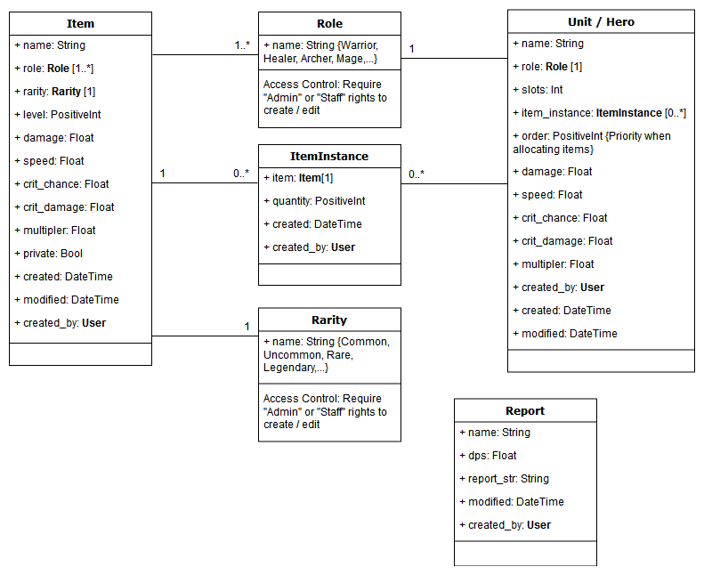

# Item Optimizer

A public library where users can share items information and generate the best item combinations based on each user own item's inventory.

Built using Django and deployed on 3 different cloud platforms. PostgreSQL (Django ORM) and optional MFA / 2FA integrations.



---

### Deployments:

[Google App Engine: https://item-opt.appspot.com](https://item-opt.appspot.com)

- Cloud SQL PostgreSQL

[AWS Lambda "Serverless": https://pks3imvspa.execute-api.ca-central-1.amazonaws.com/dev](https://pks3imvspa.execute-api.ca-central-1.amazonaws.com/dev)

- Amazon RDS PostgreSQL
- Amazon S3 bucket

[Heroku Deployment: https://iopt.herokuapp.com](https://iopt.herokuapp.com)

- Heroku Postgres
- Heroku Redis

---

### Mobile ready


---

## Workflow:

1. Add **Items**, and <b>Quantity</b>, to your <b>Inventory</b> by searching the public <b>Database</b> or adding a new Item
   <li>Add your <b>Units</b> and specify their total number of Item <b>Slots</b> </li>
   <li>Order your <b>Units</b> by drag-and-drop; those on top will have priority</li>
   <li>Run a <b>Report</b> to see the best <b>Item Combination</b> for each <b>Unit</b></li>
   <li>A non-greedy algorithm is used to find the best Items combinations per Unit </li>

---

## Frontend:

The frontend interface is made by subclassing Django's AdminSite.

```python
from django.contrib import admin

class UserSite(admin.AdminSite):
  ...
```

- Leverages Django's AdminSite in-built features (such as autocomplete and list views)

- Reduces the amount of testing required as the AdminSite class has been pre-tested

- Customization of UserSite's AdminSite interface and workflow design by overwriting and extending Forms, Templates, TemplateResponse, List View

- Admins and Staff have their own separate AdminSite to allow different levels of access control

---

### Auth0 Integrations

In this deployment: https://item-opt.appspot.com

[Auth0](https://auth0.com) authentication backend optional provides:

- Mitigates against brute force attacks
- Multi-factor authentication
- Single Sign-On / Active Directory
- Existing database user migration


---

### Item Private Toggle

Items added to the public **Item Database** have an option to be made **Private** which renders the item only viewable by the user who created the Item. This gives users the option to not list their items in the public database.

Furthermore, Admins can use it to archive outdated items and thereby reduce the no. of items being displayed and searched—all while maintaining backwards compatibility.


---

### Database Filtering

This display a list of items that a unit could possibly equip based on items in the inventory.

```python
class UnitUser(admin.ModelAdmin):
  ...
    def formfield_for_manytomany(self, db_field, request, **kwargs):
        if db_field.name == "item_instance":
            if 'object_id' in request.resolver_match.kwargs:
                unit_id = request.resolver_match.kwargs['object_id']
                unit_role = Unit.objects.get(pk=unit_id).role
                kwargs["queryset"] = ItemInstance.objects\
                    .filter(created_by=request.user).select_related('item')\
                    .filter(item__role=unit_role)
            else:
                kwargs["queryset"] = ItemInstance.objects\
                    .filter(created_by=request.user).select_related('item')
        return super().formfield_for_manytomany(db_field, request, **kwargs)
```


---

### Autocomplete

Django 2 AdminSite comes with autocomplete search out of the box!


---

## Security:

- [Argon2 password hasher](https://docs.djangoproject.com/en/2.2/topics/auth/passwords/#using-argon2-with-django), over the default PBKDF2, for better password security

- Separate 'credentials.yaml' file to store credentials instead of settings.py to avoid committing secret keys into public repo (or through Heroku's config variable dashboard)

- Chose Django over other frameworks due to their security posture

---

## Optimization:

- Reduce amount of Postgres's SQL queries with the use of QuerySet API's select_related() and prefetch_related()

  - Benchmarking using the Django Debug Toolbar (no. of SQL queries) and Locust load testing tool

- [Data Classes](https://www.youtube.com/watch?v=T-TwcmT6Rcw) (Python 3.7) for faster access, compared to NamedTuple (3.7), with slots for reduced memory footprint

- AWS Lambda serverless deployment for scalability and cost-effectiveness (non-uniform utilization)

(Updating...)
